# 🤖 AI Secretary Project Proposal

## 📋 Executive Summary

The AI Secretary is an intelligent personal productivity system designed to address the challenges of managing complex workloads as a solo QA lead while maintaining focus on high-value activities and personal development projects. This system will provide automated task prioritization, intelligent scheduling, and continuous productivity optimization through AI-powered insights.

## 🚨 Problem Statement

### ⚡ Universal Challenges in Modern Work Management

In today's fast-paced work environment, professionals across industries face increasingly complex task management challenges that traditional productivity tools fail to address effectively. These challenges are particularly acute for individual contributors and team leads who must balance multiple responsibilities while maintaining high performance standards.

**📊 Overwhelming Task Volume**: Professionals frequently manage extensive backlogs without clear prioritization frameworks, leading to focus on urgent but low-impact activities while high-value work gets delayed.

**💰 Resource Optimization Gap**: Most workers struggle to identify tasks that provide maximum return on investment (ROI), such as automation opportunities, strategic planning, or skill development initiatives that could transform their productivity long-term.

**🚧 Limited Scalability**: Current approaches require constant direct input and decision-making, preventing professionals from scaling their impact through delegation, process improvement, and team empowerment.

**⚖️ Work-Life Integration**: Balancing professional responsibilities with personal projects, continuous learning, and life commitments remains a persistent challenge for ambitious professionals.

**🔄 Context Switching Overhead**: Managing multiple project streams, client relationships, or business areas without efficient organizational structure leads to cognitive overload and reduced effectiveness.

### 🎯 Real-World Example

Consider a QA lead managing a large project single-handedly. They face the challenge of distinguishing between tasks that require immediate attention (like critical bug fixes) and those that provide long-term value (like implementing automation frameworks or training team members). Without intelligent prioritization, they may spend disproportionate time on routine tasks while missing opportunities to build systems that could eliminate future workload.

### 📈 Impact Assessment

Without a systematic approach to task management and prioritization, professionals experience:
- 📉 Reduced productivity due to focus on low-impact activities
- 🎯 Missed opportunities for high-ROI initiatives like automation and process improvements
- 🔥 Burnout from constant firefighting and reactive work patterns
- 📚 Stagnation in professional and personal development
- 🚀 Inability to scale impact beyond individual capacity

## 🏆 Competitive Analysis and Market Positioning

### 🌐 Existing Solutions Overview

The productivity and task management space includes several established players, each with distinct strengths and limitations that create opportunities for the AI Secretary system.

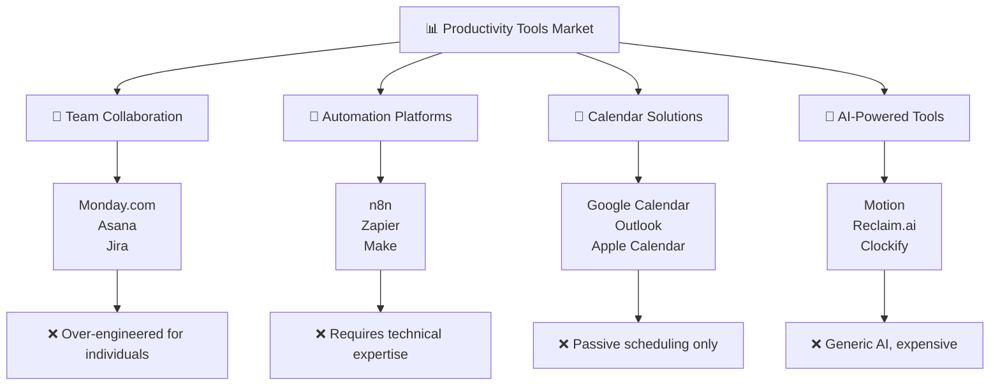

#### 🔵 Monday.com and Project Management Platforms

**✅ Strengths:**
- 📈 Comprehensive project tracking and team collaboration features
- 🎨 Visual workflow management with customizable boards
- 🔗 Integration ecosystem with popular business tools
- 📊 Strong reporting and analytics capabilities

**❌ Limitations:**
- 👥 Primarily designed for team collaboration rather than individual productivity optimization
- 🧠 Limited AI-powered prioritization and ROI analysis
- ✋ Requires manual task categorization and priority setting
- 📚 No intelligent time estimation or learning from completion patterns
- 🔧 Over-engineered for solo professionals who need streamlined personal productivity

#### 🟡 Automation Platforms (n8n, Zapier, Make)

**✅ Strengths:**
- ⚡ Powerful workflow automation capabilities
- 🔌 Extensive integration options with Google Calendar and other tools
- 🎯 Flexible trigger-based automation
- 💰 Cost-effective for technical users

**❌ Limitations:**
- 🤓 Requires significant technical expertise to set up and maintain
- 🎯 No built-in task prioritization or ROI analysis
- 🧠 Limited AI capabilities for intelligent decision-making
- 📱 Primarily reactive (trigger-based) rather than proactive productivity optimization
- 🔧 Manual workflow design doesn't adapt to changing work patterns

#### 🟢 Calendar-Based Solutions (Google Calendar, Outlook)

**✅ Strengths:**
- 🌍 Universal adoption and integration
- ⏰ Reliable scheduling and reminder systems
- 👥 Shared calendar functionality
- 📱 Mobile accessibility

**❌ Limitations:**
- 😴 Passive scheduling without intelligent optimization
- 🎯 No task prioritization or ROI analysis
- 📚 Limited learning from work patterns
- 💡 No proactive recommendations for productivity improvement
- ⚖️ Treats all calendar blocks equally without impact consideration

#### 🟣 AI-Powered Productivity Tools (Motion, Reclaim.ai)

**✅ Strengths:**
- 🤖 AI-driven scheduling optimization
- 🔗 Integration with popular calendar systems
- 📦 Automated time-blocking features
- 🎯 Focus time protection

**❌ Limitations:**
- 🎨 Limited customization for specific professional contexts
- 💰 No ROI-based task prioritization
- 💸 Expensive subscription models
- 🤖 Generic AI that doesn't learn individual work patterns deeply
- 🏢 Limited support for multi-project professional contexts

### 🚀 AI Secretary Competitive Advantages

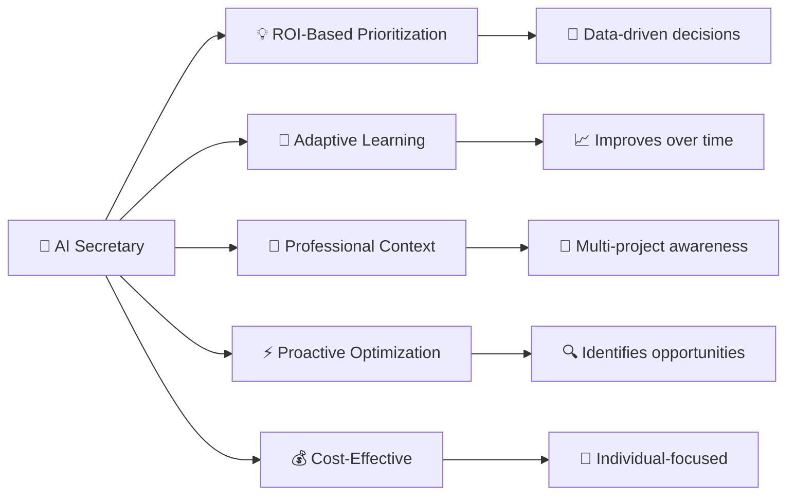

#### 💡 Intelligent ROI-Based Prioritization
Unlike existing solutions that treat all tasks equally or rely on manual priority setting, the AI Secretary system automatically analyzes task impact and provides data-driven prioritization recommendations.

#### 🧠 Adaptive Learning Architecture
The system continuously learns from work patterns, completion times, and outcomes to improve recommendations—something that static workflow automation platforms cannot provide.

#### 🎯 Professional Context Awareness
Designed specifically for professionals managing complex, multi-faceted roles with both immediate deliverables and long-term strategic initiatives.

#### ⚡ Proactive Optimization
Rather than simply organizing existing work, the system proactively identifies opportunities for automation, delegation, and process improvement.

#### 💰 Cost-Effective Personal Solution
Targeted at individual professionals rather than enterprise teams, providing sophisticated AI capabilities without the overhead of complex team management features.

### 🎯 Market Positioning

**🎯 Target Market**: Individual professionals and small team leads who need sophisticated productivity optimization without enterprise-level complexity.

**💎 Unique Value Proposition**: The only AI-powered productivity system that combines intelligent task prioritization, ROI analysis, and adaptive learning specifically designed for ambitious professionals managing complex workloads.

**🏰 Competitive Moat**: Deep learning algorithms that become more valuable over time through continuous adaptation to individual work patterns and outcomes.

## Solution Overview

The AI Secretary system will function as an intelligent personal productivity assistant that learns from work patterns, automatically prioritizes tasks based on ROI potential, and provides strategic recommendations for task delegation and process optimization.

### Key Differentiators

**Intelligent ROI Analysis**: Advanced algorithms to identify high-impact tasks such as automation opportunities and strategic hiring decisions.

**Adaptive Learning**: System learns from completion times and outcomes to improve future recommendations.

**Multi-Project Architecture**: Separate calendar systems for different project streams (work, personal, learning).

**Proactive Monitoring**: Continuous 5-minute check-ins ensure real-time optimization and prevent important tasks from being overlooked.

## 🛠️ Technical Architecture

### 🏗️ System Components

```mermaid
graph TB
    A[🤖 AI Secretary System] --> B[📋 Task Management Engine]
    A --> C[🧠 Scheduling Intelligence]
    A --> D[👁️ Monitoring System]
    A --> E[🤖 AI Assistant Layer]
    
    B --> F[📊 Multi-calendar support]
    B --> G[💰 ROI-based scoring]
    B --> H[⏱️ Time estimation ML]
    B --> I[🏷️ Auto-categorization]
    
    C --> J[🎯 Smart time-blocking]
    C --> K[📅 Meeting integration]
    C --> L[⚡ Deadline optimization]
    C --> M[🛡️ Buffer management]
    
    D --> N[⏰ 5-minute check-ins]
    D --> O[🔄 Real-time sync]
    D --> P[📈 Progress tracking]
    D --> Q[📊 Analytics engine]
    
    E --> R[💬 Natural language processing]
    E --> S[🔍 Pattern analysis]
    E --> T[💡 Recommendation engine]
    E --> U[📋 Automated reporting]
```

**📋 Task Management Engine**
- 📊 Multi-calendar support for project segmentation
- 💰 Priority scoring based on ROI analysis
- ⏱️ Time estimation with machine learning improvements
- 🏷️ Automated task categorization and filtering

**🧠 Scheduling Intelligence**
- 🎯 Smart time-blocking algorithms
- 📅 Meeting and appointment integration
- ⚡ Deadline optimization and conflict resolution
- 🛡️ Buffer time management for unexpected issues

**👁️ Monitoring System**
- ⏰ 5-minute scheduled check-ins
- 🔄 Real-time calendar synchronization
- 📈 Progress tracking and analytics
- 📊 Performance metrics and insights

**🤖 AI Assistant Layer**
- 💬 Natural language task processing
- 🔍 Productivity pattern analysis
- 💡 Recommendation engine for task optimization
- 📋 Automated reporting and insights generation

### 🔌 Integration Requirements

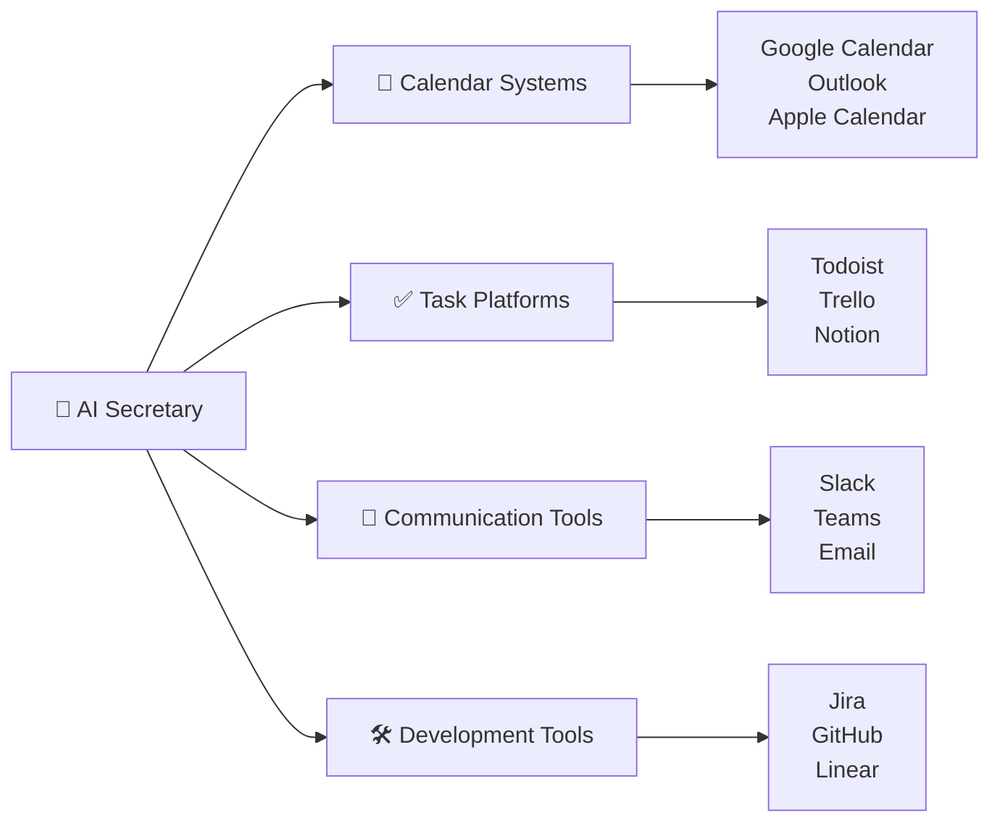

- 📅 Calendar system integration (Google Calendar, Outlook, etc.)
- ✅ Task management platforms
- 💬 Communication tools (Slack, email)
- 🛠️ Development tools and project management systems

## ⭐ Feature Specifications

### 🎯 Core Features

**🧠 Smart Task Prioritization**
- 💰 ROI-based scoring system
- 📊 Urgency vs. importance matrix analysis
- 🔍 Impact assessment for quality improvement initiatives
- 👥 Automated identification of delegation opportunities

**🎯 Intelligent Scheduling**
- 📦 Time-blocking optimization
- 📅 Meeting scheduling with buffer management
- ⏰ Deadline-aware task allocation
- ⚡ Energy level and productivity pattern consideration

**📈 Progress Monitoring**
- 📊 Real-time task completion tracking
- ⏱️ Time estimation accuracy improvement
- 📈 Productivity metrics and trends
- 🚧 Bottleneck identification and resolution

**💡 Strategic Recommendations**
- 🤖 Automation opportunity identification
- 👥 Team scaling and hiring recommendations
- 🔧 Process improvement suggestions
- 📚 Personal development time allocation

### 🚀 Advanced Features

**🧠 Learning and Adaptation**
- 📊 Historical performance analysis
- 🔍 Pattern recognition for optimal work scheduling
- 📈 Continuous improvement of time estimates
- 💡 Personalized productivity insights

**🤝 Collaboration Support**
- 👥 Task delegation tracking
- 📊 Team member workload visibility
- 🎯 Quality improvement initiative monitoring
- 📚 Knowledge sharing and documentation

## 🗺️ Implementation Roadmap

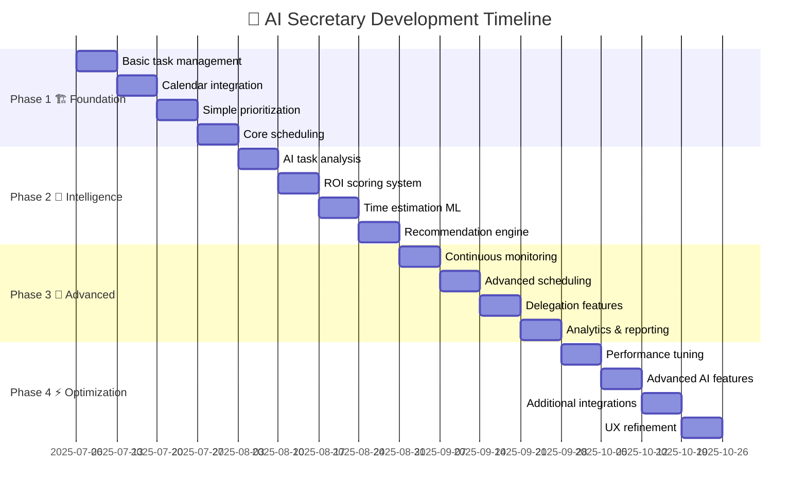

### 🏗️ Phase 1: Foundation (Weeks 1-4)
- 📋 Basic task management system
- 📅 Calendar integration
- 🎯 Simple prioritization algorithms
- ⏰ Core scheduling functionality

### 🧠 Phase 2: Intelligence Layer (Weeks 5-8)
- 🤖 AI-powered task analysis
- 💰 ROI scoring implementation
- 📊 Time estimation learning system
- 💡 Basic recommendation engine

### 🚀 Phase 3: Advanced Features (Weeks 9-12)
- 👁️ Continuous monitoring system
- 🎯 Advanced scheduling algorithms
- 👥 Delegation and team management features
- 📈 Comprehensive analytics and reporting

### ⚡ Phase 4: Optimization (Weeks 13-16)
- 🔧 Performance tuning and optimization
- 🤖 Advanced AI features
- 🔌 Integration with additional tools
- 🎨 User experience refinement

## 📊 Success Metrics

### 🎯 Primary KPIs
- **📈 Task Completion Efficiency**: Percentage improvement in high-ROI task completion
- **⏰ Time Optimization**: Reduction in time spent on low-impact activities
- **🎯 Scheduling Accuracy**: Improvement in meeting time estimates and buffer management
- **🚀 Productivity Index**: Overall productivity improvement measured through task throughput and quality

### 📋 Secondary Metrics
- **👥 Delegation Success Rate**: Percentage of successfully delegated tasks
- **🤖 Automation ROI**: Time saved through implemented automation initiatives
- **📚 Personal Project Progress**: Time allocated and progress made on personal development projects
- **😌 Stress Reduction**: Subjective measures of workload manageability

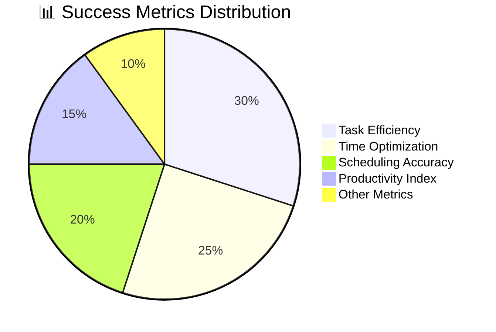

## 💼 Resource Requirements

### 🛠️ Technical Resources
- 💻 Development environment and tools
- ☁️ Cloud hosting and storage solutions
- 🧠 AI/ML processing capabilities
- 🔌 Integration APIs and services

### ⏰ Time Investment
- 🏗️ Initial development: 60-80 hours
- 🧪 Testing and refinement: 20-30 hours
- 🔧 Ongoing maintenance: 5-10 hours per month

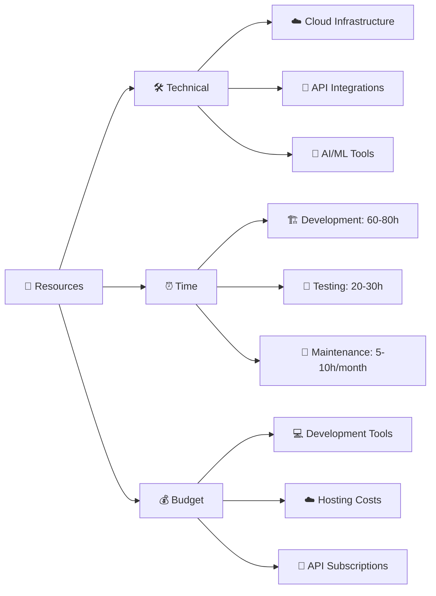

## ⚠️ Risk Assessment and Mitigation

### 🔧 Technical Risks
- **🔗 Integration Complexity**: Mitigated through phased implementation and thorough API testing
- **🎯 AI Accuracy**: Addressed through continuous learning and manual override capabilities
- **🔒 Data Privacy**: Managed through local processing and secure data handling practices

### 👥 Adoption Risks
- **📚 Learning Curve**: Minimized through intuitive interface design and gradual feature rollout
- **🔄 Over-Reliance**: Balanced through manual override options and human judgment integration

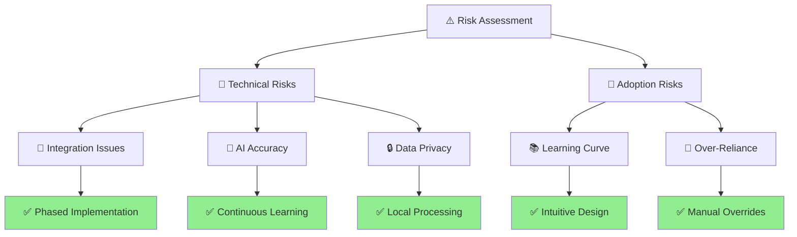

## 🎉 Conclusion

The AI Secretary project represents a strategic investment in personal productivity optimization that addresses the specific challenges of managing complex QA responsibilities while maintaining focus on high-value activities. Through intelligent task management, automated prioritization, and continuous optimization, this system will enable more effective resource allocation and create capacity for both professional excellence and personal development.

The phased implementation approach ensures manageable development while providing immediate value through core functionality, with advanced features building upon a solid foundation. Success will be measured through concrete productivity improvements and enhanced work-life integration, making this project a valuable long-term investment in professional and personal growth.

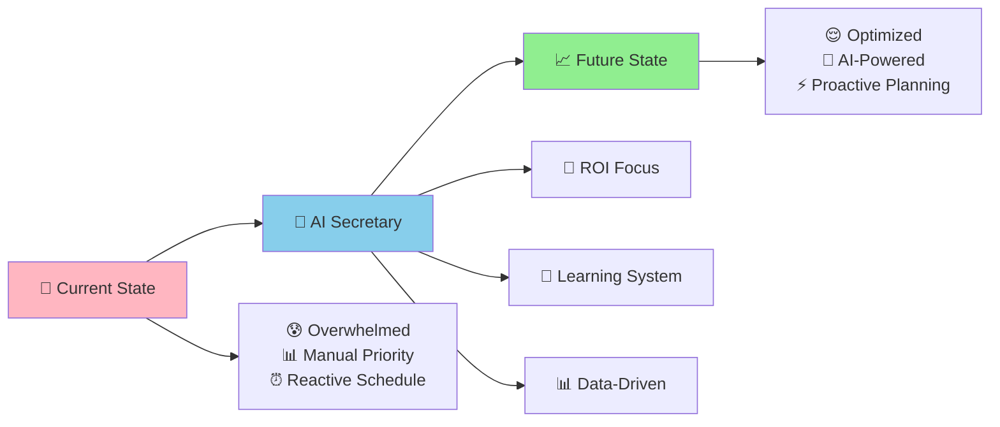

---

## 🔮 Future Enhancements & Vision

### 🌟 Phase 5+ Advanced Capabilities

**🧠 Deep Learning Evolution**
- 📱 Natural language processing for voice commands
- 🔍 Predictive task creation based on project patterns
- 🎯 Emotional intelligence for workload stress detection
- 🤖 Auto-generation of process improvement suggestions

**🌐 Ecosystem Integration**
- 🔗 Smart home integration (lighting, music for focus sessions)
- 💼 Enterprise-grade team coordination features
- 📊 Advanced business intelligence and reporting
- 🔄 Cross-platform synchronization and backup

**🎨 Personalization Engine**
- 🎵 Personalized work environment recommendations
- 🍅 Dynamic Pomodoro technique optimization
- 🎯 Context-aware notification management
- 📈 Biometric integration for energy level tracking

### 📱 Potential Platform Expansion

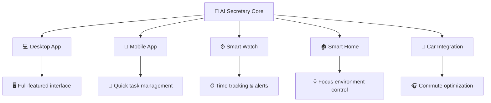

### 🚀 Market Expansion Opportunities

**👥 Team Edition**
- Multi-user coordination and delegation
- Team productivity analytics
- Resource allocation optimization
- Collaborative goal setting and tracking

**🏢 Enterprise Solutions**
- Department-level productivity insights
- Strategic initiative tracking
- Resource planning and forecasting
- Executive dashboard and reporting

**🎓 Educational Version**
- Student productivity optimization
- Assignment and project management
- Study session optimization
- Academic goal tracking

---

## 📚 Appendices

### 📖 Appendix A: Technical Specifications

**🔧 Technology Stack Recommendations**
- **Frontend**: React/Next.js with TypeScript
- **Backend**: Node.js with Express or Python with FastAPI
- **Database**: PostgreSQL with Redis for caching
- **AI/ML**: TensorFlow.js or PyTorch for learning algorithms
- **Calendar Integration**: Google Calendar API, Microsoft Graph API
- **Hosting**: AWS or Vercel for scalability

### 📊 Appendix B: Detailed Feature Breakdown

**🎯 ROI Scoring Algorithm Components**
- Time investment vs. long-term benefit analysis
- Automation potential assessment
- Skill development impact scoring
- Delegation opportunity identification
- Strategic value alignment scoring

**🧠 Machine Learning Models**
- Time estimation regression model
- Task categorization classifier
- Priority prediction algorithm
- Productivity pattern recognition
- Workload optimization neural network

### 🎨 Appendix C: User Interface Mockups

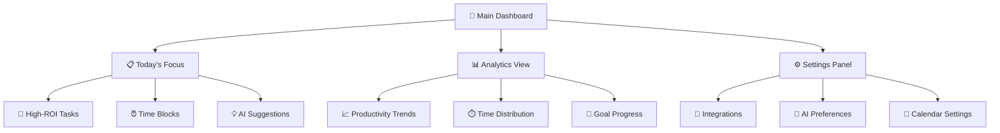

---

🚀 **Ready to transform your productivity? Let's build the future of intelligent task management!** 🚀

*"The best time to plant a tree was 20 years ago. The second best time is now. The same applies to optimizing your productivity."* 🌱 measured through concrete productivity improvements and enhanced work-life integration, making this project a valuable long-term investment in professional and personal growth.